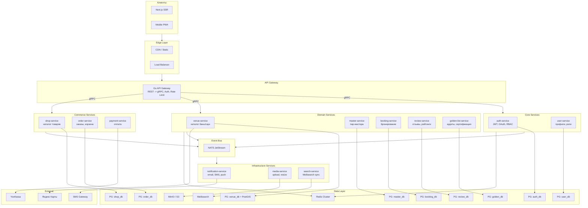
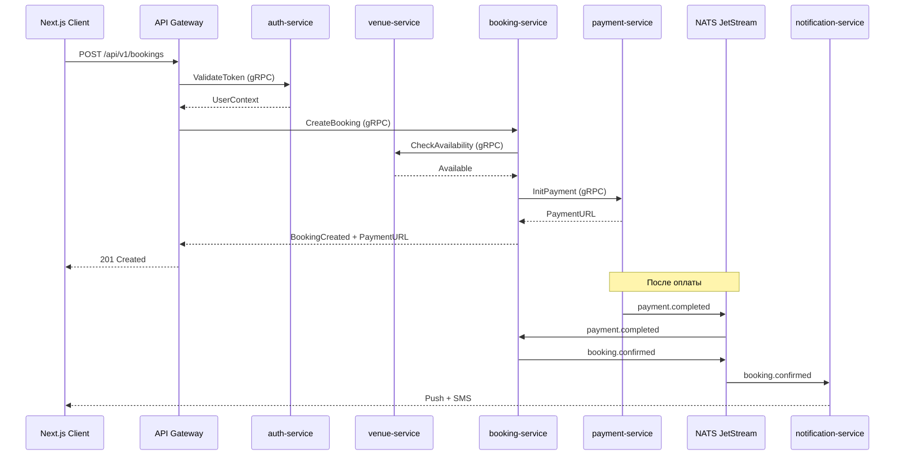
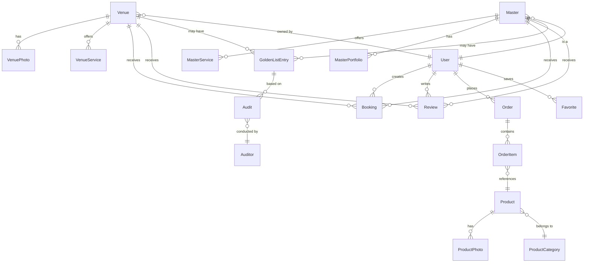
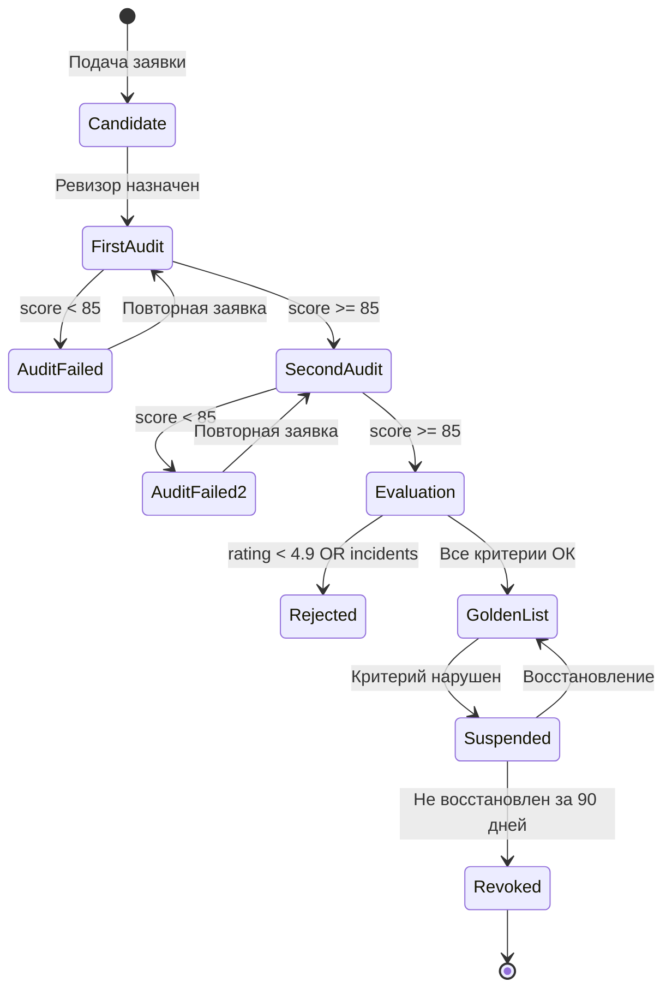
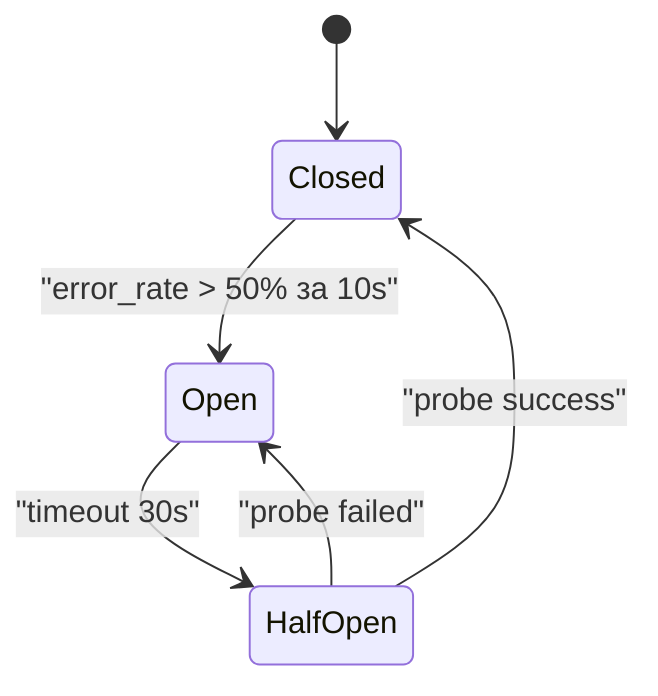
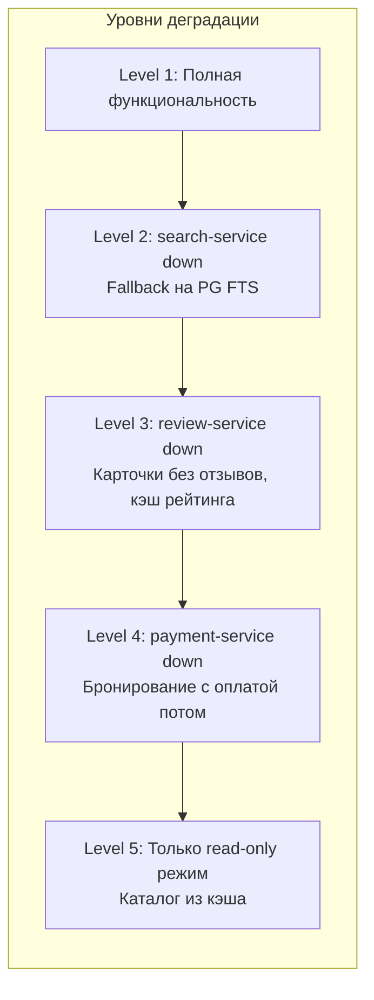
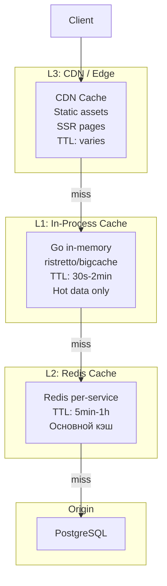
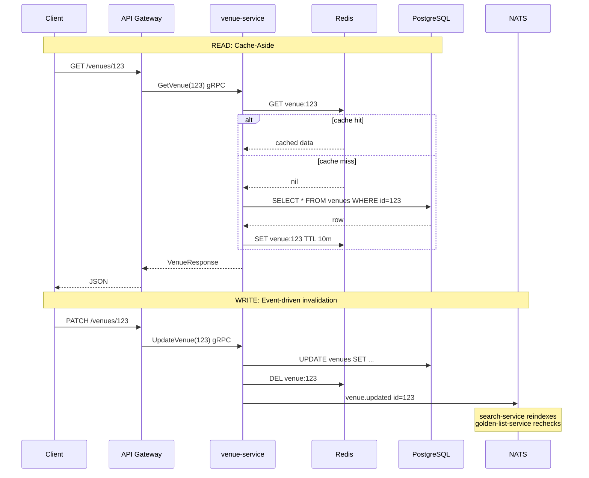
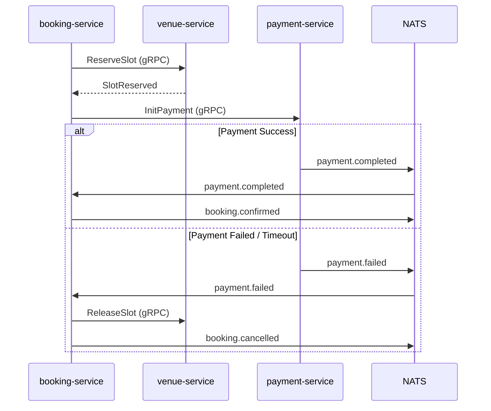
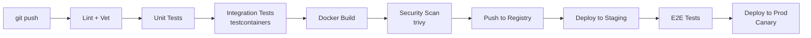

# Концепция агрегатора бань и саун

> Документ составлен по методологии System Design Skill: Analyze -> Plan -> Design -> Validate -> Document

---

## 0. ANALYZE: Требования и ограничения

### Функциональные требования (FR)

- **FR-1**: Каталог бань и саун с поиском по геолокации, типу, цене, рейтингу
- **FR-2**: Каталог пар-мастеров с профилями, портфолио, специализациями
- **FR-3**: Онлайн-бронирование бань/саун и вызов пар-мастеров с оплатой
- **FR-4**: Собственный магазин банных товаров (не маркетплейс) с корзиной, доставкой
- **FR-5**: Система "Золотой список" от НКО "Банный Ревизор" — сертификация по 4 критериям (2 аудита, рейтинг >= 4.9, 0 критических инцидентов за год, чек-лист >= 85 баллов)
- **FR-6**: Система отзывов и рейтингов для заведений и мастеров
- **FR-7**: Личные кабинеты: пользователь, владелец бани, пар-мастер, ревизор
- **FR-8**: Админ-панель: модерация, управление магазином, аналитика
- **FR-9**: Уведомления: email, SMS, push (бронирования, заказы, статусы)
- **FR-10**: SEO-оптимизация для органического трафика ("баня рядом", "сауна [город]")

### Нефункциональные требования (NFR)

- **NFR-1 (Availability)**: 99.9% uptime (не более 8.7 часов даунтайма в год)
- **NFR-2 (Latency)**: p95 < 300ms для каталога, p95 < 500ms для бронирования
- **NFR-3 (Throughput)**: начальная нагрузка ~100 RPS, целевая ~5000 RPS при росте
- **NFR-4 (Scalability)**: горизонтальное масштабирование каждого сервиса независимо
- **NFR-5 (Consistency)**: strong consistency для платежей/бронирований, eventual для рейтингов/поиска
- **NFR-6 (Security)**: шифрование PII, PCI DSS compliance (через токены платежного провайдера), RBAC
- **NFR-7 (Observability)**: distributed tracing, метрики RED/USE, structured logging
- **NFR-8 (Deployability)**: zero-downtime deployments, canary rollout, rollback < 2 min
- **NFR-9 (Data Durability)**: RPO < 1 min, RTO < 15 min (daily backups + WAL streaming)
- **NFR-10 (Geo)**: изначально Россия, архитектура готова к multi-region

### Ограничения (Constraints)

- **C-1**: Backend строго на Go (команда, производительность)
- **C-2**: PostgreSQL как primary datastore (не NoSQL)
- **C-3**: Микросервисная архитектура с первого дня (по модели Avito)
- **C-4**: Платежи только через сертифицированных провайдеров (YooKassa / Тинькофф)
- **C-5**: Золотой список управляется НКО "Банный Ревизор" — критерии фиксированы
- **C-6**: Бюджет инфраструктуры — начинаем на 2-3 серверах, Kubernetes при росте

### Допущения (Assumptions)

- **A-1**: Начальный масштаб — несколько сотен заведений, десятки мастеров, тысячи пользователей
- **A-2**: Пиковая нагрузка — вечер пятницы, суббота (бронирования), сезонность (зима > лето)
- **A-3**: Средний размер фото — 500KB-2MB, до 20 фото на заведение
- **A-4**: Соотношение read/write — 95/5 (тяжелый read для каталога, редкий write)
- **A-5**: Команда разработки — 3-5 backend, 2-3 frontend на старте

### Capacity Estimation (back-of-envelope)

- **Storage** (год 1): ~500 заведений * 20 фото * 1MB = 10GB фото; БД ~5GB; итого ~20GB
- **Storage** (год 3): ~5000 заведений, ~200GB фото, ~50GB БД
- **Traffic** (год 1): ~100 RPS avg, ~500 RPS peak (пт-сб вечер)
- **Traffic** (год 3): ~2000 RPS avg, ~10000 RPS peak
- **Bandwidth**: 100 RPS * 50KB avg response = 5MB/s; peak ~25MB/s (CDN offloads 80%)
- **DB connections**: 12 сервисов * 2 replicas * 10 connections = ~240 connections (PgBouncer)
- **NATS throughput**: ~1000 events/sec peak (lightweight JSON messages)

---

## 1. Обзор платформы

Агрегатор объединяет четыре ключевых направления:

- **FR-1/FR-2**: Каталог бань/саун и пар-мастеров — поиск, фильтрация, карта, бронирование
- **FR-3**: Онлайн-бронирование с интегрированной оплатой
- **FR-4**: Магазин банных товаров — собственная торговля платформы
- **FR-5**: Золотой список — система сертификации от НКО "Банный Ревизор"

---

## 2. Роли пользователей

| Роль                        | Описание                                                           |
| --------------------------- | ------------------------------------------------------------------ |
| **Гость**                   | Просмотр каталога, товаров, золотого списка                        |
| **Пользователь**            | Бронирование, покупки, отзывы, избранное                           |
| **Владелец бани/сауны**     | Управление заведением, расписанием, ценами, фото                   |
| **Пар-мастер**              | Профиль, услуги, расписание, портфолио                             |
| **Администратор платформы** | Модерация, управление магазином, аналитика                         |
| **Ревизор (НКО)**           | Проведение аудитов, выставление баллов, управление Золотым списком |

---

## 3. Технологический стек

- **Backend**: Go микросервисы (Chi router, Clean Architecture, protobuf контракты)
- **Inter-service**: gRPC (синхронные вызовы) + NATS JetStream (асинхронные события)
- **API Gateway**: Go (маршрутизация, аутентификация, rate limiting, агрегация)
- **Frontend**: Next.js 14+ (App Router, SSR/SSG для SEO)
- **Database**: PostgreSQL 16 per-service (database-per-service pattern) + PostGIS для гео
- **Cache**: Redis per-service (кэш, rate limiting) + Redis Cluster (сессии)
- **Object Storage**: MinIO / S3 (фото заведений, товаров, портфолио)
- **Search**: Meilisearch (полнотекстовый + фасетный поиск по каталогу)
- **Payments**: YooKassa / Тинькофф Оплата
- **Maps**: Яндекс Карты API
- **Orchestration**: Docker Compose (dev) -> Kubernetes (prod)
- **Service Mesh**: Envoy sidecar (в production)
- **Observability**:
  - Prometheus + Grafana (метрики)
  - Jaeger (distributed tracing)
  - Sentry (error tracking)
  - ELK / Loki (логи)
- **CI/CD**: GitHub Actions + Docker + Helm charts

---

## 4. Микросервисная архитектура (по модели Avito)

### Принципы (как в Avito):

- Каждый сервис = отдельный Go-модуль со своей БД (database-per-service)
- gRPC для синхронных запросов между сервисами
- NATS JetStream для событийной модели (eventual consistency)
- API Gateway как единая точка входа для клиентов (REST -> gRPC трансляция)
- Каждый сервис деплоится и масштабируется независимо
- Единый proto-репозиторий для контрактов

### Схема архитектуры:



### Взаимодействие сервисов (ключевые потоки):



### Ключевые события в NATS:

- `user.registered` — новый пользователь (-> notification, search)
- `venue.created` / `venue.updated` — изменения заведений (-> search, golden-list)
- `master.created` / `master.updated` — изменения мастеров (-> search, golden-list)
- `booking.created` / `booking.confirmed` / `booking.cancelled` — жизненный цикл бронирования (-> notification, analytics)
- `payment.completed` / `payment.failed` — платежные события (-> booking, order, notification)
- `review.created` — новый отзыв (-> venue/master rating recalc, golden-list check)
- `order.created` / `order.shipped` — заказы магазина (-> notification, analytics)
- `audit.completed` — аудит завершен (-> golden-list evaluation)
- `golden_list.status_changed` — статус золотого списка (-> notification, search reindex)

---

## 5. Модель данных (ключевые сущности)



### Ключевые таблицы:

- **users** — id, email, phone, role, name, avatar_url, created_at
- **venues** — id, owner_id, name, type (баня/сауна/хаммам/...), description, address, lat, lng, price_from, capacity, amenities (JSONB), working_hours (JSONB), is_active, golden_list_status
- **venue_photos** — id, venue_id, url, sort_order, is_cover
- **venue_services** — id, venue_id, name, duration_min, price, description
- **masters** — id, user_id, display_name, bio, experience_years, specializations (JSONB), hourly_rate, travel_radius_km, is_mobile, golden_list_status
- **master_services** — id, master_id, name, duration_min, price, description
- **master_portfolio** — id, master_id, photo_url, description
- **bookings** — id, user_id, venue_id, master_id (nullable), service_id, date, time_from, time_to, status (pending/confirmed/cancelled/completed), total_price, payment_id
- **reviews** — id, user_id, venue_id (nullable), master_id (nullable), rating, text, photos (JSONB), created_at, is_verified
- **products** — id, category_id, name, description, price, stock_qty, photos (JSONB), attributes (JSONB), is_active
- **product_categories** — id, parent_id, name, slug, icon_url
- **orders** — id, user_id, status, total, delivery_address, delivery_type, payment_id, created_at
- **order_items** — id, order_id, product_id, qty, price_at_purchase
- **golden_list_entries** — id, entity_type (venue/master), entity_id, status (active/suspended/revoked), awarded_at, valid_until, checklist_score, current_rating
- **audits** — id, entity_type, entity_id, auditor_id, date, checklist_score, notes, result (pass/fail), critical_incidents
- **favorites** — id, user_id, entity_type, entity_id

---

## 6. Система "Золотой список"

### Критерии входа (по ТЗ от НКО "Банный Ревизор"):

- Минимум 2 пройденных аудита
- Текущий рейтинг >= 4.9
- Отсутствие критических инцидентов за последние 12 месяцев
- Балл по чек-листу стандартов >= 85

### Автоматизация:

- Система ежедневно пересчитывает соответствие критериям для всех участников
- При падении ниже порога — автоматический перевод в статус `suspended` с уведомлением
- Ревизор проводит аудит через специальный интерфейс с чек-листом
- Результаты аудита фиксируются и доступны публично (прозрачность)

### Отображение на платформе:

- Специальный бейдж "Золотой список" в карточке заведения/мастера
- Отдельная страница-витрина "Золотой список" с фильтрами
- Приоритет в поисковой выдаче (бустинг в ранжировании)
- Специальная отметка в результатах поиска на карте



---

## 7. Магазин банных товаров

Собственный магазин платформы (не маркетплейс):

- **Категории**: веники, масла/аромамасла, шапки и текстиль, косметика, аксессуары, камни для каменки, ковши и шайки и т.д.
- **Корзина и оформление заказа** с доставкой (СДЭК, Почта России) или самовывозом
- **Интеграция с платежной системой** (YooKassa)
- **Система промокодов и скидок**
- **Рекомендации товаров** на страницах бань/мастеров (контекстные)
- **Управление складом** (остатки, уведомления при малом остатке)

---

## 8. Ключевые страницы (фронтенд)

### Публичные:

- **Главная** — поиск, карта, подборки, золотой список (топ), популярные товары
- **Каталог бань/саун** — фильтры (тип, цена, район, рейтинг, золотой список), карта, список
- **Карточка заведения** — фото-галерея, описание, услуги, цены, расписание, отзывы, бейдж золотого списка, кнопка бронирования
- **Каталог пар-мастеров** — фильтры (специализация, цена, рейтинг, выезд), карта
- **Профиль мастера** — портфолио, услуги, отзывы, бейдж, кнопка записи
- **Магазин** — каталог товаров, категории, карточка товара, корзина, оформление
- **Золотой список** — витрина сертифицированных заведений и мастеров
- **Страницы бронирования/оплаты**

### Личные кабинеты:

- **Пользователь** — бронирования, заказы, избранное, отзывы
- **Владелец заведения** — статистика, бронирования, управление профилем, фото, цены
- **Пар-мастер** — расписание, заявки, портфолио, доход
- **Ревизор** — назначенные аудиты, чек-листы, история

### Админ-панель:

- Модерация заведений и мастеров
- Управление магазином (товары, заказы, склад)
- Управление золотым списком
- Аналитика и отчеты

### CRM и операционный кабинет партнёра (эволюция)

**Текущее состояние.** Отдельного продукта или модуля с названием «CRM» в системе нет. Уже реализованы элементы **операционного кабинета**: владелец заведения видит свои площадки, брони по заведению, ручные блокировки слотов, редактирование карточки (услуги, залы, фото); пар-мастер — профиль и свои брони; администратор платформы — модерация. Это не полноценная CRM в классическом смысле (воронки B2B, сделки, сквозная коммерческая аналитика), но база для развития.

**Цель при введении сотрудников.** Владелец бани сможет приглашать **сотрудников заведения** с доступом к **базовой CRM** — набору функций вокруг слотов, броней и гостя, без дублирования роли `venue_owner` у каждого человека. Доступ должен опираться на **членство в заведении** (`venue_id` + пользователь) и **роли / scopes** (например: только брони и календарь; или расширенные права), с проверкой на бэкенде, а не только скрытием кнопок во фронте.

**Рекомендуемое содержание базовой CRM (MVP).**

| Блок | Содержание |
|------|------------|
| **Команда и права** | Приглашения, статусы, отзыв доступа; роли (владелец / менеджер / смена); минимальный **аудит** критичных действий (кто изменил бронь, отменил). |
| **Операционный день** | Слоты на сегодня/ближайшие дни; список броней с фильтром по статусу; связь с уже существующими **ручными блокировками** слотов. |
| **Карточка брони** | Все поля брони, оплата, услуга/зал; **внутренний комментарий** только для персонала; при необходимости — короткая история статусов. |
| **Гость (лёгкий контекст)** | В рамках брони: контакты, число визитов в это заведение; полноценная «база клиентов» с сегментами — отдельный этап. |
| **Задачи и напоминания** | Простые задачи на дату («перезвонить», «подготовить зал»), исполнитель — сотрудник или «любой со смены». |
| **Аналитика для владельца** | Развитие текущих метрик (брони за день, выручка за период, рейтинг): загрузка по дням, no-show при введении статуса, разрез по залам/услугам — поэтапно. |
| **Отзывы** | Лента отзывов по заведению, отметка «прочитано» / внутренняя пометка для смены. |

**Связь с будущими подписками.** Базовая CRM хорошо ложится на **воронку**: бесплатный (или базовый) тариф оставляет сильным **ядро** — календарь, список броней, ограниченное число сотрудников; платные уровни — **масштаб** (больше сотрудников и филиалов), **расширенная аналитика и экспорт**, **задачи и напоминания**, **чат с гостем и шаблоны**, **интеграции**, **аудит и приоритетная поддержка**. Имеет смысл заранее заложить в модель данных **`plan` / feature flags** на уровне заведения (даже если изначально все флаги включены), чтобы монетизация не ломала схему.

**Технические ориентиры.** Отдельный сервис не обязателен на первом шаге: расширение `venue-service` / `user-service` таблицей членства и проверками в `api-gateway` + доработка фронта `/owner/...`. При появлении **чата** между клиентом и заведением/мастером — отдельный **chat-service** (хранение сообщений, ACL, доставка через WebSocket или SSE при сохранении REST/gRPC). События из CRM (новая задача, новый комментарий к брони) могут публиковаться в **NATS** для уведомлений.

**Связь с коммуникациями.** Чат с гостем логично привязывать к **брони** или к отдельной заявке («вопрос до брони»), с общим ACL: клиент видит только свои треды; сотрудник — только треды своих `venue_id` по членству.

---

## 9. Структура репозитория (Go Backend, monorepo)

```
/
├── proto/                          -- Единый proto-репозиторий (gRPC контракты)
│   ├── auth/v1/auth.proto
│   ├── user/v1/user.proto
│   ├── venue/v1/venue.proto
│   ├── master/v1/master.proto
│   ├── booking/v1/booking.proto
│   ├── review/v1/review.proto
│   ├── shop/v1/shop.proto
│   ├── order/v1/order.proto
│   ├── golden/v1/golden.proto
│   ├── payment/v1/payment.proto
│   ├── notification/v1/notification.proto
│   └── media/v1/media.proto
│
├── services/                       -- Микросервисы
│   ├── api-gateway/                -- API Gateway (REST -> gRPC)
│   │   ├── cmd/main.go
│   │   ├── internal/
│   │   │   ├── handler/            -- REST-хэндлеры
│   │   │   ├── middleware/         -- auth, rate limit, CORS, tracing
│   │   │   └── aggregator/        -- агрегация ответов нескольких сервисов
│   │   ├── Dockerfile
│   │   └── go.mod
│   │
│   ├── auth-service/               -- Аутентификация
│   │   ├── cmd/main.go
│   │   ├── internal/
│   │   │   ├── domain/            -- сущности, интерфейсы
│   │   │   ├── usecase/           -- бизнес-логика
│   │   │   ├── repository/        -- PostgreSQL
│   │   │   ├── delivery/
│   │   │   │   └── grpc/          -- gRPC server
│   │   │   └── infrastructure/    -- JWT, OAuth providers
│   │   ├── migrations/
│   │   ├── Dockerfile
│   │   └── go.mod
│   │
│   ├── user-service/               -- (аналогичная структура)
│   ├── venue-service/
│   ├── master-service/
│   ├── booking-service/
│   ├── review-service/
│   ├── shop-service/
│   ├── order-service/
│   ├── golden-list-service/
│   ├── payment-service/
│   ├── notification-service/
│   ├── media-service/
│   └── search-service/
│
├── pkg/                            -- Общие библиотеки (shared Go packages)
│   ├── logger/                     -- Structured logging (zerolog)
│   ├── tracer/                     -- Jaeger/OpenTelemetry init
│   ├── nats/                       -- NATS JetStream client wrapper
│   ├── postgres/                   -- PG connection + migration helper
│   ├── redis/                      -- Redis client wrapper
│   ├── auth/                       -- JWT validation (для gateway + сервисов)
│   └── errors/                     -- Стандартные ошибки платформы
│
├── deploy/
│   ├── docker-compose.yml          -- Локальная разработка (все сервисы)
│   ├── docker-compose.infra.yml    -- Инфраструктура (PG, Redis, NATS, Meilisearch)
│   └── k8s/                        -- Kubernetes манифесты / Helm charts
│       ├── charts/
│       └── values/
│
├── tools/
│   ├── protogen/                   -- Генерация Go-кода из proto
│   └── migrate/                    -- Миграции для всех сервисов
│
├── Makefile                        -- build, test, proto-gen, docker, lint
└── README.md
```

### Структура каждого микросервиса (Clean Architecture):

```
services/<service-name>/
├── cmd/
│   └── main.go                     -- Точка входа: config, DI, graceful shutdown
├── internal/
│   ├── domain/                     -- Entities + Repository/UseCase interfaces
│   │   ├── entity.go
│   │   └── repository.go
│   ├── usecase/                    -- Бизнес-логика (реализация интерфейсов)
│   │   └── service.go
│   ├── repository/                 -- PostgreSQL-реализация
│   │   └── postgres.go
│   ├── delivery/
│   │   └── grpc/                   -- gRPC server handlers
│   │       ├── server.go
│   │       └── mapper.go           -- proto <-> domain mapping
│   └── events/                     -- NATS publishers/subscribers
│       ├── publisher.go
│       └── subscriber.go
├── migrations/                     -- SQL-миграции для этого сервиса
├── config/
│   └── config.go
├── Dockerfile
├── go.mod
└── go.sum
```

---

## 10. Структура проекта (Next.js Frontend)

```
/src
  /app
    /(public)
      /page.tsx              -- главная
      /venues/[slug]         -- карточка заведения
      /masters/[slug]        -- профиль мастера
      /shop                  -- магазин
      /golden-list           -- золотой список
    /(auth)
      /login, /register
    /(dashboard)
      /my/bookings           -- мои бронирования
      /my/orders             -- мои заказы
      /owner/[venueId]       -- кабинет владельца
      /master/dashboard      -- кабинет мастера
      /admin                 -- админ-панель
      /auditor               -- кабинет ревизора
  /components
    /ui                      -- базовые UI-компоненты
    /venue                   -- компоненты заведений
    /master                  -- компоненты мастеров
    /shop                    -- компоненты магазина
    /golden-list             -- компоненты золотого списка
    /booking                 -- форма бронирования
    /map                     -- Яндекс карта
  /lib
    /api                     -- клиент API
    /hooks                   -- React hooks
    /utils                   -- утилиты
  /store                     -- Zustand (состояние корзины, фильтров)
```

---

## 11. API Gateway (REST) и gRPC-контракты

### REST API (API Gateway -> клиенты):

- `POST /api/v1/auth/register`, `/login`, `/refresh`, `/logout` — авторизация
- `GET/PATCH /api/v1/users/me` — профиль текущего пользователя
- `GET /api/v1/venues`, `GET /api/v1/venues/:slug` — каталог бань
- `GET /api/v1/venues/search?lat=..&lng=..&radius=..&type=..&golden=true` — гео-поиск
- `POST /api/v1/venues` (owner) — регистрация заведения
- `GET /api/v1/masters`, `GET /api/v1/masters/:slug` — пар-мастера
- `POST /api/v1/bookings`, `GET /api/v1/bookings/my` — бронирование
- `POST /api/v1/reviews` — отзывы
- `GET /api/v1/shop/products`, `GET /api/v1/shop/categories` — магазин
- `POST /api/v1/shop/cart/checkout` — оформление заказа
- `GET /api/v1/golden-list` — витрина золотого списка
- `POST /api/v1/audits` (auditor) — проведение аудита
- `GET /api/v1/search?q=..&type=venue|master|product` — единый поиск

### gRPC-контракты (между сервисами):

Каждый сервис экспонирует gRPC API, вызываемый gateway или другими сервисами. API Gateway транслирует REST-запросы клиентов в gRPC-вызовы к нужным сервисам и агрегирует ответы (например, карточка заведения = venue-service + review-service + golden-list-service).

---

## 12. Монетизация платформы

- **Комиссия с бронирований** (5-15% от суммы)
- **Маржа с продажи товаров** в собственном магазине
- **Платное размещение** (premium-листинг для заведений)
- **Подготовка к аудиту** золотого списка (консалтинг)
- **Рекламные интеграции** (баннеры, спецпредложения)

---

## 13. Отказоустойчивость (Fault Tolerance)

### Circuit Breaker

Каждый gRPC-клиент оборачивается в Circuit Breaker (библиотека `sony/gobreaker`):

- **Closed** (норма): запросы проходят, считаются ошибки
- **Open** (сервис недоступен): запросы мгновенно отклоняются, возвращается fallback
- **Half-Open** (проба): пропускается один запрос для проверки восстановления



Пример: если `review-service` упал, карточка заведения все равно отдается — просто без отзывов (graceful degradation).

### Retry с Exponential Backoff

- gRPC-вызовы: макс. 3 retry, backoff 100ms -> 200ms -> 400ms + jitter
- NATS consumer: retry с backoff до 5 попыток, затем Dead Letter Queue
- Внешние API (YooKassa, SMS): retry 3 раза с backoff 1s -> 2s -> 4s

### Timeouts (бюджет времени)

Каждый вызов имеет строгий timeout:

- API Gateway -> сервис: 3s (по умолчанию), 10s (для тяжелых агрегаций)
- Сервис -> сервис (gRPC): 2s
- Сервис -> PostgreSQL: 5s
- Сервис -> Redis: 500ms
- Сервис -> внешний API: 10s
- Общий timeout запроса клиента: 15s

### Bulkhead (изоляция)

- Каждый gRPC-клиент имеет отдельный connection pool (падение одного сервиса не блокирует соединения к другим)
- Отдельные горутинные пулы для критичных (booking, payment) и некритичных (review, search) вызовов
- Rate limit per-service в API Gateway (shop-service не может "съесть" весь capacity gateway)

### Graceful Degradation (каскадная деградация)



Правила деградации:

- **Некритичные сервисы** (review, notification, search): при недоступности — пропускаем или берем из кэша
- **Критичные сервисы** (auth, booking, payment): при недоступности — retry + очередь + уведомление оператору
- **Карточка заведения**: агрегируется из 4 сервисов; если 1-2 недоступны — отдаем частичный ответ
- **Поиск**: при падении Meilisearch — fallback на PostgreSQL FTS (медленнее, но работает)

### Dead Letter Queue (DLQ)

Сообщения NATS, не обработанные после 5 retry, попадают в DLQ:

- Отдельный NATS stream `dlq.*` для каждого типа события
- Алерт в Grafana при росте DLQ
- Админ-интерфейс для просмотра и повторной отправки (replay)
- Автоматический replay по расписанию (каждые 15 минут)

### Health Checks

Каждый сервис реализует:

- **Liveness** (`/healthz`): процесс жив, может принимать запросы
- **Readiness** (`/readyz`): все зависимости доступны (PG, Redis, NATS)
- **Startup** probe: для сервисов с долгой инициализацией (search-service, миграции)

### Redundancy

- Каждый сервис запускается минимум в **2 репликах**
- PostgreSQL: primary + streaming replica (async) для read-heavy сервисов (venue, shop)
- Redis: Sentinel (3 ноды) для automatic failover
- NATS: кластер из 3 нод (Raft consensus)
- API Gateway: 3+ инстанса за Load Balancer

---

## 14. Стратегия кэширования

### Многоуровневое кэширование



### Что и как кэшируется

**venue-service:**

- Список заведений (по городу/району): Redis, TTL 5 min, инвалидация по `venue.updated`
- Карточка заведения: Redis, TTL 10 min, инвалидация по `venue.updated`
- Гео-поиск результаты: Redis, TTL 2 min (по хешу параметров запроса)
- Счетчики (кол-во заведений по городу): in-memory, TTL 1 min

**master-service:**

- Список мастеров: Redis, TTL 5 min
- Профиль мастера: Redis, TTL 10 min
- Расписание (доступные слоты): Redis, TTL 1 min (часто меняется)

**review-service:**

- Агрегированный рейтинг (venue/master): Redis, TTL 15 min, инвалидация по `review.created`
- Последние 10 отзывов: Redis, TTL 5 min
- Полный список отзывов: не кэшируется (пагинация из PG)

**shop-service:**

- Каталог товаров: Redis, TTL 10 min
- Карточка товара: Redis, TTL 15 min
- Категории: in-memory, TTL 1 hour (редко меняются)
- Остатки на складе: Redis, TTL 30s (часто меняются при заказах)

**golden-list-service:**

- Витрина золотого списка: Redis, TTL 1 hour (меняется редко)
- Статус сертификации (по entity): Redis, TTL 30 min

**auth-service:**

- JWT public keys: in-memory, TTL 1 hour
- Сессии: Redis Cluster, TTL = session lifetime
- Rate limit counters: Redis, TTL = window size

### Стратегии инвалидации

- **Event-driven** (основная): NATS-событие -> подписчик сбрасывает ключ в Redis
- **TTL-based** (дополнительная): на случай потери события
- **Cache-aside pattern**: читаем из кэша -> miss -> читаем из БД -> пишем в кэш
- **Write-through** (для критичных данных): пишем в БД + сразу обновляем кэш



### Защита от проблем кэширования

- **Cache Stampede** (thundering herd): singleflight pattern — при одновременных запросах на один ключ только один идет в БД, остальные ждут результат
- **Hot Key**: in-memory L1 кэш (ristretto) для top-100 заведений по просмотрам
- **Cache Penetration** (запросы несуществующих ключей): кэширование "пустых" ответов с коротким TTL (30s)
- **Big Key**: сегментация больших объектов (список из 1000 заведений -> кэш по страницам)

---

## 15. Консистентность данных (Data Consistency)

### Saga Pattern для распределенных транзакций

Бронирование = мульти-сервисная операция. Используем **Choreography Saga** через NATS:



Компенсирующие действия:

- Оплата не прошла -> освобождаем слот в venue-service
- Venue не смог зарезервировать -> отменяем платеж
- Timeout на любом шаге -> откат всех предыдущих шагов

### Idempotency (идемпотентность)

Все мутирующие операции идемпотентны:

- Клиент передает `Idempotency-Key` в заголовке для POST-запросов
- Gateway сохраняет ключ + результат в Redis (TTL 24h)
- При повторном запросе с тем же ключом — возвращает сохраненный результат
- Критично для платежей: один `payment_id` = одно списание, даже при retry

### Eventual Consistency

- Рейтинг пересчитывается асинхронно по событию `review.created` (задержка до 5s — допустимо)
- Поисковый индекс Meilisearch обновляется асинхронно (задержка до 10s)
- Золотой список пересчитывается ежедневно batch-процессом (не real-time)
- Счетчики (просмотры, бронирования) — eventual consistent через Redis increment + периодический flush в PG

### Optimistic Locking

- Бронирование слотов: версионирование через `version` поле + `UPDATE ... WHERE version = ?`
- Остатки товаров: `UPDATE products SET stock = stock - 1 WHERE id = ? AND stock > 0`
- Предотвращение double-booking через уникальный constraint `(venue_id, date, time_from)`

---

## 16. Безопасность (Security)

### Аутентификация и авторизация

- **JWT** (access token, 15 min) + **Refresh Token** (httpOnly cookie, 30 days)
- **RBAC**: роли хранятся в claims JWT, проверяются на уровне Gateway
- **OAuth 2.0**: вход через Яндекс ID, VK ID, Telegram
- **2FA**: TOTP для владельцев заведений и ревизоров (опционально)

### API Security

- **Rate Limiting** (Token Bucket): per-user, per-IP, per-endpoint
  - Анонимы: 60 req/min
  - Авторизованные: 300 req/min
  - Критичные эндпоинты (login, register): 10 req/min per IP
- **Input Validation**: protobuf-схемы + `go-playground/validator` на каждом сервисе
- **SQL Injection**: parameterized queries (pgx), никаких строковых конкатенаций
- **XSS**: Content-Security-Policy headers, санитизация отзывов (bluemonday)
- **CORS**: whitelist доменов
- **HTTPS**: TLS termination на Load Balancer, mTLS между сервисами в mesh

### Защита данных

- **Персональные данные**: шифрование PII в БД (AES-256) для phone, email
- **Пароли**: Argon2id (не bcrypt — устойчивее к GPU-атакам)
- **Платежные данные**: не хранятся на платформе, только token от YooKassa
- **Логи**: маскирование PII в логах (phone -> +7***1234)
- **Бэкапы**: encrypted at rest (AES-256)

### Audit Log

- Все действия администраторов и ревизоров логируются в отдельную таблицу `audit_log`
- Immutable append-only (soft-delete запрещен)
- Поля: who, when, what, entity_type, entity_id, old_value, new_value, ip_address

---

## 17. Масштабирование (Scalability)

### Горизонтальное масштабирование

- Все сервисы stateless — масштабируются добавлением реплик
- HPA (Horizontal Pod Autoscaler) в K8s по CPU/memory/RPS
- Рекомендуемые начальные реплики:
  - API Gateway: 3
  - venue-service, shop-service: 3 (read-heavy)
  - booking-service, payment-service: 2 (write-heavy, но меньший RPS)
  - Остальные: 2

### Database Scaling

- **Read Replicas**: venue_db, shop_db — primary + 1 async replica
- **Connection Pooling**: PgBouncer перед каждой БД (transaction mode)
- **Partitioning**: bookings таблица — partition by month (архивирование старых)
- **Индексы**:
  - venues: GiST index на geography(lat, lng) для гео-запросов
  - bookings: B-tree composite (venue_id, date, time_from)
  - reviews: B-tree (venue_id, created_at DESC) для пагинации
  - products: GIN index на attributes (JSONB) для фильтрации

### NATS Scaling

- 3 ноды в кластере (Raft)
- Partitioning потоков по entity_id для параллельной обработки
- Consumer groups для горизонтального масштабирования подписчиков

### Frontend Performance

- **ISR** (Incremental Static Regeneration): каталоговые страницы регенерируются раз в 5 min
- **Edge caching**: CDN для статики + stale-while-revalidate для SSR
- **Code splitting**: lazy-load карты, галереи, форм бронирования
- **Image optimization**: Next.js Image component + WebP + srcset
- **Bundle size**: tree-shaking, dynamic imports для тяжелых библиотек

---

## 18. Observability (по модели Avito)

- **Каждый сервис** инструментирован OpenTelemetry (traces + metrics)
- **Distributed Tracing** (Jaeger): сквозной trace-id через все сервисы для любого запроса
- **Метрики** (Prometheus): RPS, latency (p50/p95/p99), error rate, queue depth
- **RED-метрики** per service: Rate, Errors, Duration
- **USE-метрики** per resource: Utilization, Saturation, Errors (CPU, memory, PG connections, Redis connections)
- **Алерты**: SLO-based (99.9% availability per service)
- **Логи**: structured JSON logging (zerolog), агрегация в Loki/ELK
- **Health checks**: readiness + liveness + startup probes для каждого сервиса
- **Dashboards**: Grafana
  - System: RED per service, USE per resource
  - Business: бронирования/час, выручка, конверсия, NPS

---

## 19. DevOps и CI/CD

### Pipeline



### Deployment Strategy

- **Staging**: полная копия prod (docker-compose на одном сервере)
- **Production**: Kubernetes с Canary deployment
  - Новая версия сервиса -> 10% трафика -> мониторинг 15 min -> 50% -> 100%
  - Автоматический rollback при росте error rate
- **Feature Flags** (Go feature library или внешний сервис): отключение фич без деплоя
- **Database Migrations**: выполняются до деплоя нового кода (backward-compatible only)

### Secrets Management

- **Kubernetes Secrets** (dev/staging)
- **HashiCorp Vault** или **Yandex Lockbox** (production)
- Никаких секретов в коде, git, Docker images
- Rotation: JWT signing keys каждые 90 дней, DB passwords каждые 180 дней

---

## 20. Тестирование

- **Unit Tests**: бизнес-логика (usecase layer), 80%+ coverage
- **Integration Tests**: repository layer с testcontainers (реальный PostgreSQL, Redis)
- **Contract Tests**: proto-файлы = контракт, buf breaking change detection
- **E2E Tests**: ключевые user flows (регистрация -> поиск -> бронирование -> оплата)
- **Load Tests**: k6 сценарии для ключевых эндпоинтов
- **Chaos Tests** (на staging): случайное убийство подов, проверка восстановления

---

## 21. Чек-лист Golden Practices

- [x] **Database per service** — изоляция данных
- [x] **API Gateway** — единая точка входа
- [x] **Circuit Breaker** — защита от каскадных отказов
- [x] **Retry + Exponential Backoff** — устойчивость к transient failures
- [x] **Timeout budgets** — предотвращение зависших запросов
- [x] **Bulkhead** — изоляция ресурсов между сервисами
- [x] **Graceful Degradation** — работа при частичном отказе
- [x] **Dead Letter Queue** — обработка необработанных событий
- [x] **Saga Pattern** — распределенные транзакции
- [x] **Idempotency** — безопасные повторные запросы
- [x] **Event-Driven Architecture** — асинхронная связность
- [x] **CQRS-light** — разделение read/write через кэш + replicas
- [x] **Multi-level Caching** — L1 in-memory, L2 Redis, L3 CDN
- [x] **Cache Stampede Protection** — singleflight pattern
- [x] **Distributed Tracing** — сквозная трассировка запросов
- [x] **Structured Logging** — JSON logs с trace-id
- [x] **Health Checks** — liveness, readiness, startup probes
- [x] **Rate Limiting** — защита от abuse
- [x] **Input Validation** — на каждом слое
- [x] **Secrets Management** — Vault / Lockbox
- [x] **Canary Deployments** — безопасный rollout
- [x] **Feature Flags** — управление фичами без деплоя
- [x] **Optimistic Locking** — конкурентные записи
- [x] **Backward-Compatible Migrations** — zero-downtime DB changes
- [x] **Contract Testing** — proto breaking change detection
- [x] **Audit Log** — неизменяемый лог действий
- [x] **PII Encryption** — шифрование персональных данных
- [x] **Horizontal Autoscaling** — HPA по метрикам
- [x] **Connection Pooling** — PgBouncer
- [x] **SLO-based Alerting** — алерты привязаны к бизнес-целям

---

## 22. VALIDATE: Трассировка требований к дизайну

### Покрытие функциональных требований

- **FR-1** (Каталог бань) -> venue-service + search-service + PostGIS гео-поиск (раздел 4, 5) -- COVERED
- **FR-2** (Каталог мастеров) -> master-service + search-service (раздел 4, 5) -- COVERED
- **FR-3** (Бронирование + оплата) -> booking-service + payment-service + Saga (раздел 4, 15) -- COVERED
- **FR-4** (Магазин товаров) -> shop-service + order-service + payment-service (раздел 4, 7) -- COVERED
- **FR-5** (Золотой список) -> golden-list-service + audits + auto-check cron (раздел 6) -- COVERED
- **FR-6** (Отзывы/рейтинги) -> review-service + event-driven rating recalc (раздел 4, 14) -- COVERED
- **FR-7** (Личные кабинеты) -> user-service + фронтенд dashboard routes (раздел 8, 10) -- COVERED
- **FR-8** (Админ-панель) -> admin routes + RBAC в gateway (раздел 8, 16) -- COVERED
- **FR-9** (Уведомления) -> notification-service + NATS events (раздел 4) -- COVERED
- **FR-10** (SEO) -> Next.js SSR/SSG + ISR + CDN (раздел 3, 17) -- COVERED

### Покрытие нефункциональных требований

- **NFR-1** (99.9% availability) -> redundancy min 2 replicas, circuit breaker, graceful degradation, health checks (раздел 13) -- COVERED
- **NFR-2** (p95 < 300ms каталог) -> multi-level cache L1+L2+CDN, Redis p99 < 1ms, PG с индексами (раздел 14, 17) -- COVERED
- **NFR-3** (5000 RPS target) -> HPA autoscaling, connection pooling, stateless services (раздел 17) -- COVERED
- **NFR-4** (Horizontal scaling) -> database-per-service, stateless, K8s HPA (раздел 4, 17) -- COVERED
- **NFR-5** (Consistency model) -> Saga + idempotency для платежей, eventual для рейтингов (раздел 15) -- COVERED
- **NFR-6** (Security) -> JWT+RBAC, PII encryption, Argon2id, rate limiting, audit log (раздел 16) -- COVERED
- **NFR-7** (Observability) -> OpenTelemetry + Jaeger + Prometheus + Grafana + Loki (раздел 18) -- COVERED
- **NFR-8** (Zero-downtime deploy) -> canary deployment, backward-compatible migrations, feature flags (раздел 19) -- COVERED
- **NFR-9** (RPO < 1min) -> PG WAL streaming replica, Redis Sentinel, encrypted backups (раздел 13) -- COVERED
- **NFR-10** (Multi-region ready) -> stateless services, CDN edge, DB replica topology extensible -- COVERED (architecture allows it)

### Покрытие ограничений

- **C-1** (Go backend) -> все сервисы на Go, Chi router, Clean Architecture -- SATISFIED
- **C-2** (PostgreSQL) -> database-per-service, все на PG + PostGIS -- SATISFIED
- **C-3** (Микросервисы с первого дня) -> 12 сервисов, gRPC, NATS, monorepo -- SATISFIED
- **C-4** (Сертифицированные платежи) -> YooKassa/Тинькофф, токены, не храним карты -- SATISFIED
- **C-5** (Критерии НКО фиксированы) -> golden-list-service реализует 4 критерия как конфиг -- SATISFIED
- **C-6** (Бюджет: 2-3 сервера старт) -> Docker Compose на старте, K8s при росте -- SATISFIED

### Validation Notes (потенциальные риски)

- **RISK-1**: 12 микросервисов для команды из 5 backend-разработчиков — высокая операционная нагрузка на старте. **Mitigation**: monorepo + общий pkg + шаблоны сервисов снижают boilerplate; при необходимости wave 1-2 можно объединить venue+master в один сервис.
- **RISK-2**: NATS JetStream менее зрел чем Kafka для event sourcing. **Mitigation**: используем только pub/sub + at-least-once delivery, не event sourcing; миграция на Kafka при росте тривиальна (абстракция через pkg/nats).
- **RISK-3**: Meilisearch — менее battle-tested чем Elasticsearch. **Mitigation**: fallback на PostgreSQL FTS, Meilisearch достаточен для ~5000 документов на старте.
- **RISK-4**: Eventual consistency рейтингов может вызвать confusion у пользователей. **Mitigation**: при создании отзыва — оптимистичное обновление на фронте; задержка backend < 5s.

### Follow-up Items

- [ ] Определить точный список полей чек-листа НКО "Банный Ревизор" (85 баллов из скольких?)
- [ ] Уточнить требования к доставке товаров (география, сроки, интеграции)
- [ ] Провести threat modeling (STRIDE) для платежного потока
- [ ] Определить SLA для внешних провайдеров (YooKassa, Яндекс Карты)
- [ ] Спроектировать детальный API contract (OpenAPI 3.0) для каждого сервиса
- [ ] Определить стратегию миграции данных при переходе с MVP на полную версию

---

## 23. Следующие шаги (рекомендация)

### Wave 1 — Фундамент (инфраструктура + core):

1. Monorepo setup: proto/, pkg/, deploy/, Makefile
2. Docker Compose инфраструктура (PostgreSQL, Redis, NATS, Meilisearch)
3. `auth-service` + `user-service` (JWT, регистрация, профили)
4. `api-gateway` (REST, auth middleware, routing)
5. Next.js frontend scaffold + auth-страницы

### Wave 2 — Основной домен:

1. `venue-service` (каталог бань/саун, PostGIS, CRUD)
2. `master-service` (профили мастеров, расписание)
3. `search-service` (Meilisearch sync, единый поиск)
4. Frontend: каталог, карта, карточки заведений/мастеров

### Wave 3 — Транзакции:

1. `booking-service` (бронирование, календарь)
2. `payment-service` (YooKassa интеграция)
3. `review-service` (отзывы, пересчет рейтингов)
4. Frontend: бронирование, оплата, отзывы

### Wave 4 — Коммерция:

1. `shop-service` + `order-service` (магазин, корзина, заказы)
2. Frontend: магазин, корзина, оформление

### Wave 5 — Золотой список + админка:

1. `golden-list-service` (аудиты, сертификация, автопроверки)
2. Frontend: витрина золотого списка, кабинет ревизора
3. Админ-панель (модерация, аналитика)

### Wave 6 — Polish:

1. `notification-service` (email, SMS, push)
2. `media-service` (upload, resize, CDN)
3. Observability (Jaeger, Prometheus, Grafana)
4. SEO-оптимизация, PWA, performance
