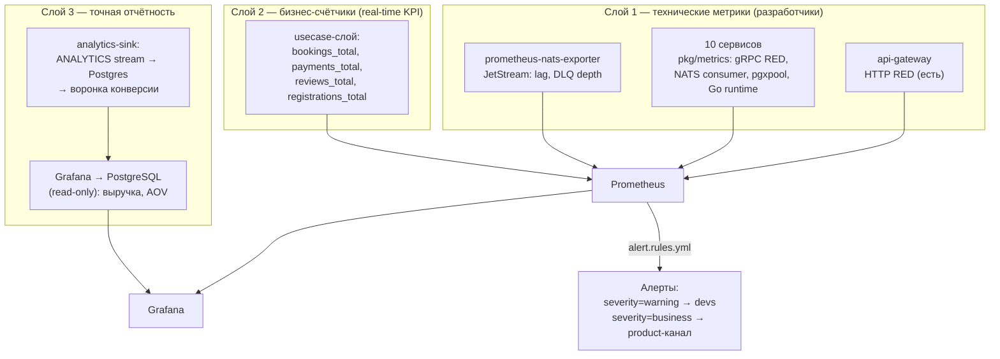

# Система метрик платформы — design doc

Статус: **реализованы все три слоя** — Phase 1 (технический), Phase 2 (бизнес-счётчики, алерты, дашборд), §6.1 (SQL-выручка через `grafana_ro`, см. `deploy/grafana-ro.sh`) и Phase 3 (стрим ANALYTICS + `services/analytics-service` + дашборд product-analytics)
Дата: 2026-06-10 (обновлено 2026-06-11)
Связано: `docs/PROJECT.md` §18 (Observability, NFR-7), `deploy/docker-compose.observability.yml`

## 1. Цель

Доработать существующий observability-стек так, чтобы он отвечал на два разных вопроса:

| Аудитория | Вопрос | Инструмент |
|---|---|---|
| Разработчики | «Сервисы живы? Где деградация? Что сломалось после деплоя?» | RED/USE-метрики, алерты, трейсы |
| Руководство | «Платформа работает? Сколько броней/оплат/выручки? Где теряем пользователей?» | Бизнес-дашборд, бизнес-алерты, точная отчётность |

Не цель: аналитика для владельцев площадок (это продуктовые API,
`frontend/src/app/owner/.../finance/`), NPS-опросы, BI-хранилище.

## 2. Что уже есть (инвентаризация)

| Компонент | Состояние |
|---|---|
| Prometheus + Grafana + Loki + Promtail + Jaeger | развёрнуты (`deploy/docker-compose.observability.yml`) |
| api-gateway | RED по HTTP (`api_gateway_http_requests_total`, `..._duration_seconds`), OTel-трейсы, JSON-логи → Loki, 1 дашборд, 2 SLO-алерта |
| 10 backend-сервисов (auth, user, venue, booking, review, payment, master, chat, crm, notification) | **ничего**: чистый gRPC, нет HTTP-листенера, нет `/metrics`, нет health-чеков |
| NATS JetStream | стримы BOOKINGS, PAYMENTS, REVIEWS, VENUES, CHAT_EVENTS, PAYMENTS_DLQ; события `booking.*`, `payment.*`, `review.created` уже публикуются |
| Продуктовая аналитика | frontend → `POST /api/v1/analytics/events` → JSON-лог + plain-NATS `analytics.web` → debug-подписчик nats-box (**данные никуда не сохраняются**) |

Известные проблемы текущей реализации (исправляются в Phase 1):

1. **`/metrics` гейтвея публично доступен**: Caddy проксирует `{$API_DOMAIN}`
   целиком на `api-gateway:8080` (`deploy/Caddyfile:48`), а `/metrics` смонтирован
   на том же листенере (`cmd/router.go:215`). Утечка: route-паттерны, объёмы
   трафика, статистика support-вебхуков.
2. **Кардинальность route-лейбла**: `routeLabel()` в
   `internal/metrics/prometheus.go` при отсутствии chi-паттерна (404, скан-боты)
   подставляет сырой `r.URL.Path` → неограниченный рост числа серий.
3. `analytics.web` публикуется в core NATS вне стрима — события теряются, если
   нет активного подписчика.

## 3. Архитектура: три слоя



- **Слой 1** — здоровье системы. Источник: инструментация кода + экспортёры.
- **Слой 2** — операционные бизнес-сигналы в реальном времени. Источник:
  счётчики в usecase-слое рядом с публикацией доменных событий. Точность —
  «достаточная для тренда» (Prometheus переживает рестарты счётчиков через
  `increase()`).
- **Слой 3** — точные цифры для отчётов (выручка, конверсия). Источник: SQL по
  боевым БД через read-only пользователей + витрина продуктовых событий.
  Слой 2 отвечает «что происходит сейчас», слой 3 — «сколько точно было».

## 4. Слой 1 — технические метрики

### 4.1. Новый пакет `pkg/metrics`

Самописный, ~150 строк, по образцу существующего
`api-gateway/internal/metrics` (stdlib-first, без go-grpc-middleware):

```go
m := metrics.New("booking_service")        // namespace = booking_service
m.UnaryServerInterceptor()                  // в grpc.ChainUnaryInterceptor(...)
m.ObserveNATS(subject, result, duration)    // вызов из NATS-хендлеров
m.RegisterPgxPool(pool)                     // collector поверх pool.Stat()
m.Serve(ctx, cfg.MetricsAddr, readyFn)      // /metrics + /healthz + /readyz
```

`Serve` поднимает **отдельный внутренний HTTP-листенер** (`METRICS_ADDR`,
default `:9100`) — не публикуется на хост, доступен только из docker-сети.
Регистрирует также стандартные `GoCollector` и `ProcessCollector`.

### 4.2. Каталог метрик (каждый сервис)

| Метрика | Тип | Лейблы | Назначение |
|---|---|---|---|
| `{svc}_grpc_handled_total` | counter | `method`, `code` | Rate + Errors |
| `{svc}_grpc_handling_seconds` | histogram | `method` | Duration (p50/p95/p99) |
| `{svc}_nats_messages_total` | counter | `subject`, `result=ok\|error\|dlq` | надёжность consumers |
| `{svc}_nats_handling_seconds` | histogram | `subject` | латентность обработки событий |
| `{svc}_pgxpool_*` (total/idle/max conns, empty_acquire_total) | gauge/counter | — | USE: насыщение пула БД |
| `go_*`, `process_*` | — | — | USE: runtime (goroutines, GC, RSS) |

`method` — короткая форма `Service/Method`, `code` — каноническое имя gRPC-кода.
Оба множества конечны → кардинальность ограничена по построению.

### 4.3. Экспортёры в compose

- **prometheus-nats-exporter** (обязательно): `jetstream_stream_messages`
  (глубина PAYMENTS_DLQ!), `jetstream_consumer_num_pending` (lag consumers).
- node-exporter / cadvisor / postgres_exporter — **отложено** (tier 2): на
  одном хосте с docker-compose ценность ниже, чем стоимость поддержки.

### 4.4. Scrape-конфигурация

`deploy/observability/prometheus.yml`: статические таргеты по именам
compose-сервисов — `auth-service:9100`, `user-service:9100`, … (11 джобов +
nats-exporter). Service discovery не нужен, состав сервисов фиксирован.

### 4.5. Технические алерты (дополнение `alert.rules.yml`)

| Алерт | Условие | for |
|---|---|---|
| `TargetDown` | `up == 0` | 3m |
| `ServiceGrpcErrorRateHigh` | доля `code=~"Internal\|Unknown\|Unavailable\|DataLoss"` > 5% | 5m |
| `ServiceGrpcP95High` | p95 > 1s по сервису | 10m |
| `NATSConsumerErrors` | `rate({svc}_nats_messages_total{result="error"}[10m]) > 0` | 10m |
| `DLQNotEmpty` | `jetstream_stream_messages{stream="PAYMENTS_DLQ"} > 0` | 15m |
| `PgxPoolSaturated` | `empty_acquire` растёт / conns == max | 10m |

(Алерт по DLQ закрывает пункт «Алерт в Grafana при росте DLQ» из PROJECT.md.)

## 5. Слой 2 — бизнес-счётчики

Инкременты в **usecase-слое**, рядом с публикацией доменного события — паттерн
уже существует в gateway (`metrics.ObserveSupportWebhookDelivery`). Не в
delivery (туда не доходят NATS-переходы) и не в repository (там нет бизнес-смысла).

Реализация: пакет `internal/kpi` в каждом сервисе (package-level, как
`gwmetrics` в гейтвее), регистрация в реестр `pkg/metrics` из main.

| Сервис | Метрика | Лейблы |
|---|---|---|
| booking | `booking_service_bookings_total` | `event=created\|confirmed\|cancelled\|completed` |
| payment | `payment_service_payments_total` | `status=succeeded\|cancelled\|refunded` — доменные значения; «failed» в домене зовётся `cancelled` |
| payment | `payment_service_payments_amount_rub_total` (опционально, см. §8) | — (только succeeded) |
| review | `review_service_reviews_total` | `rating=1..5` |
| auth | `auth_service_registrations_total` | `method=password\|oauth_{provider}` |
| auth | `auth_service_logins_total` | `result=ok\|fail`, `method` |

Производные значения считаются в PromQL, новых метрик не требуют:
payment success rate = `succeeded / (succeeded + failed)`;
доля отмен = `cancelled / created`; средний рейтинг =
`sum(rating × increase(reviews_total[7d])) / sum(increase(reviews_total[7d]))`.

### Бизнес-алерты (`severity: business`, отдельный канал уведомлений)

| Алерт | Условие | for |
|---|---|---|
| `PaymentSuccessRateLow` | success rate < 90% **и** ≥ 5 платежей за окно | 30m |
| `NoBookingsDuringBusinessHours` | `increase(bookings_total{event="created"}[2h]) == 0` в 08–22 MSK | — |
| `CancellationSpike` | cancelled/created > 50% | 1h |

Guard на минимальный объём обязателен — иначе ночью алерты будут врать.

## 6. Слой 3 — точная отчётность и продуктовая аналитика

### 6.1. Grafana → PostgreSQL (Phase 2)

Datasource с read-only пользователем (`grafana_ro`: `SELECT`-only,
`statement_timeout=5s`) к БД payment- и booking-сервисов. Панели: выручка
по дням (точная, из `payments` со статусом succeeded), средний чек,
конверсия created→succeeded по дням, повторные клиенты.

Ограничение: cross-DB join невозможен (БД-на-сервис), поэтому «выручка по
площадкам с именами» — только после Phase 3 (денормализация в витрину) или
через продуктовые API.

### 6.2. analytics-sink (Phase 3)

1. Gateway начинает публиковать `analytics.web` в JetStream-стрим `ANALYTICS`
   (`EnsureStream(js, "ANALYTICS", []string{"analytics.>"})` — идемпотентно,
   retention по возрасту, например 30 дней).
2. Новый минимальный сервис `services/analytics-service`: durable consumer →
   таблица `analytics.events (ts, event, request_id, props jsonb)` в своей БД.
   Go-консьюмер вместо Benthos/Vector — консистентность со стеком, ~150 строк.
3. Grafana (SQL datasource): воронка `page_view → venue_view → booking
   submitted → payment.succeeded`, разрезы по `utm_*`, топ страниц входа.

`props` уже отфильтрованы серверным whitelist'ом в gateway
(`handler/analytics.go`) — PII в витрину не попадает by construction.

## 7. Дашборды

| Дашборд | Аудитория | Содержимое |
|---|---|---|
| `api-gateway-overview` (есть) | devs | HTTP RED гейтвея, логи — без изменений |
| `platform-services-red` (новый) | devs | grid по 10 сервисам: RPS/err%/p95 gRPC; NATS lag + errors; DLQ depth; пулы БД; goroutines/RSS |
| `business-kpi` (новый) | руководство | верх — крупные stat-панели: брони сегодня (vs вчера), payment success 24h, выручка вчера (SQL), регистрации, средний рейтинг 7d; ниже — тренды: брони/час по статусам, succeeded vs failed, доля отмен; Phase 3 — воронка и utm |

`business-kpi` — отдельная Grafana-папка «Business», виден руководству без
технического шума; никакого PromQL для чтения не требуется.

## 8. Сквозные правила

1. **Кардинальность**: в лейблах Prometheus **никогда** не бывает
   `user_id` / `venue_id` / `booking_id` / сырых путей. Всё «по сущностям» —
   это слой 3 (SQL). `routeLabel` чинится: нет chi-паттерна → `"unmatched"`.
2. **PII**: метрики — агрегаты без идентификаторов; webhook-logging-policy из
   `CLAUDE.md` не затрагивается (метрики ≠ логи, инкременты живут в
   usecase-слое, не в request-path вебхука). `payments_amount_rub_total` —
   осознанное исключение: агрегированная сумма без лейблов; включать только
   после явного решения (альтернатива «выручка только из SQL» — дефолт).
3. **Безопасность**: `/metrics` всех сервисов — только внутренняя docker-сеть.
   У gateway `/metrics` переезжает с `:8080` на отдельный `METRICS_ADDR`
   (+ страховочный `respond 403` для `/metrics` в Caddyfile).
4. **Соглашения**: namespace = имя сервиса (как `api_gateway_*`), единицы в
   имени (`_seconds`, `_rub`), counters с `_total`, гистограммы — дефолтные
   бакеты, пока профиль латентности не потребует иного.

## 9. План внедрения

### Phase 1 — фундамент (~2–3 дня)
`pkg/metrics`; интерсептор + `METRICS_ADDR`-листенер во всех 10 сервисах;
nats-exporter в compose; scrape-конфиг; дашборд `platform-services-red`;
технические алерты; фикс `routeLabel`; закрыть публичный `/metrics`.
**Приёмка**: все таргеты `up` в Prometheus; RPS/err/p95 видны по каждому
сервису; остановка любого сервиса даёт алерт ≤ 5 мин; `curl
https://api.<domain>/metrics` → 403/404.

### Phase 2 — бизнес-метрики (~2 дня)
Счётчики в usecase booking/payment/review/auth; дашборд `business-kpi`;
бизнес-алерты; `grafana_ro` + SQL-панели выручки.
**Приёмка**: тестовый сценарий «бронь → оплата → отзыв» двигает все счётчики;
руководство отвечает на «сколько броней сегодня и какая выручка вчера» без
участия разработчика.

### Phase 3 — продуктовая аналитика (~3–4 дня)
Стрим `ANALYTICS`; `analytics-service` (sink → Postgres); воронка и utm-разрезы
в `business-kpi`.
**Приёмка**: воронка просмотр→бронь→оплата за произвольный период; события
переживают рестарт sink-а (durable consumer).

Отложено: node/postgres-экспортёры, OTel-metrics-pipeline, ClickHouse
(рассматривать при > ~1M событий/день), NPS.

## 10. Валидация против требований

| Требование | Покрытие |
|---|---|
| PROJECT.md §18: RED per service | ✅ слой 1 (gRPC + HTTP) |
| §18: USE per resource | ✅ частично: пулы БД + Go runtime; node/cadvisor отложены осознанно |
| §18: SLO-алерты | ✅ §4.5 + бизнес-алерты сверх плана |
| §18: dashboards System + Business («бронирования/час, выручка, конверсия») | ✅ §7; NPS — вне scope (нет механики опросов) |
| §18: «каждый сервис инструментирован OpenTelemetry (traces + metrics)» | ⚠️ отступление: метрики — Prometheus SDK pull (консистентно с готовым кодом gateway, проще), OTel остаётся для трейсов. Миграция на OTel-metrics возможна позже без смены PromQL |
| CLAUDE.md: webhook logging policy | ✅ §8.2 |
| Clean Architecture / правила pkg | ✅ shared-код в `pkg/metrics`, инкременты в usecase, паттерн уже принят в gateway |
